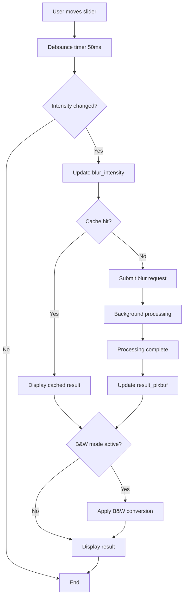
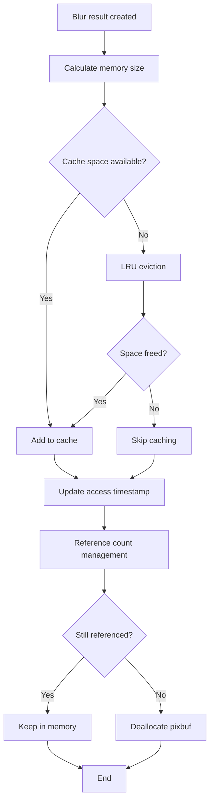

# Data Model: Image Blur Effect

## Core Data Entities

### BlurParameters
**Purpose**: Encapsulates all parameters needed for blur processing
```c
typedef struct {
    gdouble intensity;              // Range: 0.0 - 10.0
    gdouble sigma;                  // Calculated: intensity * 2.0
    gint kernel_size;               // Calculated: 2 * ceil(3 * sigma) + 1
    gboolean is_progressive;        // TRUE during slider drag, FALSE for final
} BlurParameters;
```

**Validation Rules**:
- intensity: 0.0 ≤ intensity ≤ 10.0
- sigma: Derived value, always positive when intensity > 0
- kernel_size: Always odd, minimum 3, maximum 121 (for intensity=10.0)
- is_progressive: Boolean state for quality control

**State Transitions**:
- INACTIVE (intensity=0.0) → ACTIVE (intensity>0.0): Initialize blur processing
- DRAGGING (is_progressive=TRUE) → FINAL (is_progressive=FALSE): Upgrade to full quality
- ACTIVE → INACTIVE: Clear cached blur results and reset to original

### BlurCache
**Purpose**: LRU cache for previously computed blur results
```c
typedef struct {
    GHashTable *cache_table;        // key: intensity_string → value: BlurCacheEntry
    GQueue *lru_queue;              // Ordered list for LRU eviction
    gsize total_memory_bytes;       // Current cache memory usage
    gsize max_memory_bytes;         // Memory limit (150MB)
    guint max_entries;              // Maximum cached blur variants (5)
} BlurCache;

typedef struct {
    gchar *intensity_key;           // "2.5" format for 0.1 precision
    GdkPixbuf *blurred_pixbuf;      // Cached blur result
    gsize memory_size;              // Memory footprint of this entry
    gint64 access_timestamp;        // Last access time for LRU
    gint reference_count;           // Reference counting for thread safety
} BlurCacheEntry;
```

**Validation Rules**:
- cache_table: Key must match intensity_key format "%.1f"
- total_memory_bytes: Must not exceed max_memory_bytes
- reference_count: Must be ≥0, prevents premature deallocation
- access_timestamp: Updated on every cache hit

### BlurProcessingContext  
**Purpose**: Manages blur processing state and threading
```c
typedef struct {
    BlurParameters current_params;   // Current blur settings
    GdkPixbuf *source_pixbuf;       // Original image (immutable)
    GdkPixbuf *result_pixbuf;       // Current processed result
    
    // Threading state
    GThread *worker_thread;         // Background processing thread
    GAsyncQueue *work_queue;        // Work item queue
    GAsyncQueue *result_queue;      // Result callback queue
    gboolean cancel_requested;     // Cancellation flag
    GMutex state_mutex;             // Thread synchronization
    
    // Processing state
    gboolean is_processing;         // TRUE during blur computation
    gdouble progress;               // 0.0 - 1.0 processing progress
    GError *last_error;             // Latest processing error
} BlurProcessingContext;
```

**State Transitions**:
- IDLE → PROCESSING: When new blur request submitted
- PROCESSING → COMPLETE: When blur computation finishes
- PROCESSING → CANCELLED: When user changes intensity before completion
- COMPLETE → IDLE: After result displayed and context cleaned

### HelloImageViewerBlur
**Purpose**: Integration point with existing HelloImageViewer
```c
typedef struct {
    // Embedded in HelloImageViewer private struct
    BlurCache *blur_cache;          // Shared blur result cache
    BlurProcessingContext *context; // Current processing state
    
    // UI state
    gdouble blur_intensity;         // Current slider value 0.0-10.0
    gboolean blur_enabled;          // TRUE when intensity > 0.0
    guint blur_timeout_id;          // Debouncing timer ID
    
    // Integration with existing features
    gboolean bw_mode_active;        // Existing B&W toggle state
    GdkPixbuf *original_pixbuf;     // Original unprocessed image
} HelloImageViewerBlur;
```

**Relationships**:
- **Composition**: Contains BlurCache and BlurProcessingContext
- **Association**: References original_pixbuf from parent HelloImageViewer
- **Coordination**: Integrates with existing bw_mode_active state

## Data Flow Model

### User Interaction Flow


### Memory Management Flow


## Validation Rules and Constraints

### Input Validation
```c
// Blur intensity validation
gboolean validate_blur_intensity(gdouble intensity) {
    return (intensity >= 0.0 && intensity <= 10.0);
}

// Memory limit validation  
gboolean validate_memory_usage(BlurCache *cache, gsize new_entry_size) {
    return (cache->total_memory_bytes + new_entry_size <= cache->max_memory_bytes);
}

// Pixbuf validation
gboolean validate_pixbuf_for_blur(GdkPixbuf *pixbuf) {
    if (!pixbuf) return FALSE;
    gint width = gdk_pixbuf_get_width(pixbuf);
    gint height = gdk_pixbuf_get_height(pixbuf);
    return (width > 0 && height > 0 && width <= 8192 && height <= 8192);
}
```

### Performance Constraints  
- **Response Time**: UI updates must complete within 100ms
- **Processing Time**: Full blur processing ≤500ms for HD images
- **Memory Usage**: Total blur overhead ≤200MB
- **Thread Usage**: Maximum 4 worker threads regardless of system cores

### Quality Constraints
- **Precision**: Blur intensity stored to 0.1 precision (1 decimal place)
- **Edge Handling**: Mirror edge pixels to prevent dark borders
- **Color Depth**: Support 24-bit RGB and 32-bit RGBA pixbufs
- **Progressive Quality**: Drag quality minimum 25% of final quality

## Error Handling Model

### Error Categories
```c
typedef enum {
    BLUR_ERROR_NONE = 0,
    BLUR_ERROR_INVALID_INTENSITY,    // intensity out of range
    BLUR_ERROR_INVALID_PIXBUF,       // NULL or corrupted pixbuf
    BLUR_ERROR_MEMORY_ALLOCATION,    // Failed to allocate processing memory
    BLUR_ERROR_PROCESSING_FAILED,    // Blur algorithm failed
    BLUR_ERROR_THREAD_FAILED,        // Background thread creation failed
    BLUR_ERROR_CACHE_FULL           // Cache eviction failed
} BlurErrorCode;
```

### Error Recovery Strategies
- **INVALID_INTENSITY**: Clamp to valid range [0.0, 10.0], log warning
- **INVALID_PIXBUF**: Disable blur processing, show original image
- **MEMORY_ALLOCATION**: Clear cache and retry, fallback to no-cache mode
- **PROCESSING_FAILED**: Show original image, display error message to user
- **THREAD_FAILED**: Fall back to synchronous processing with progress indication
- **CACHE_FULL**: Operate without caching, log performance warning

## Integration Points

### Existing HelloImageViewer Integration
```c
// Add to HelloImageViewer private struct
struct _HelloImageViewerPrivate {
    // Existing fields...
    GtkWidget *bw_button;
    GdkPixbuf *original_pixbuf;
    GdkPixbuf *current_pixbuf;
    gboolean is_bw_converted;
    
    // New blur integration fields
    HelloImageViewerBlur *blur_handler;
    GtkWidget *blur_scale;
    GtkWidget *blur_value_label;
    GtkWidget *blur_icon;
};
```

### UI Template Integration
```xml
<!-- Add to hello-image-viewer.ui header bar -->
<object class="GtkBox">
  <property name="orientation">horizontal</property>
  <property name="spacing">6</property>
  <child>
    <object class="GtkImage" id="blur_icon">
      <property name="icon-name">image-filter-symbolic</property>
    </object>
  </child>
  <child>
    <object class="GtkScale" id="blur_scale">
      <property name="orientation">horizontal</property>
      <property name="adjustment">blur_adjustment</property>
      <property name="draw-value">false</property>
      <property name="width-request">150</property>
    </object>
  </child>
  <child>
    <object class="GtkLabel" id="blur_value_label">
      <property name="text">0.0</property>
      <property name="width-chars">3</property>
    </object>
  </child>
</object>

<object class="GtkAdjustment" id="blur_adjustment">
  <property name="lower">0.0</property>
  <property name="upper">10.0</property>
  <property name="step-increment">0.1</property>
  <property name="page-increment">1.0</property>
</object>
```

This data model provides a complete foundation for implementing the blur effect feature while maintaining clean separation of concerns and efficient resource management.